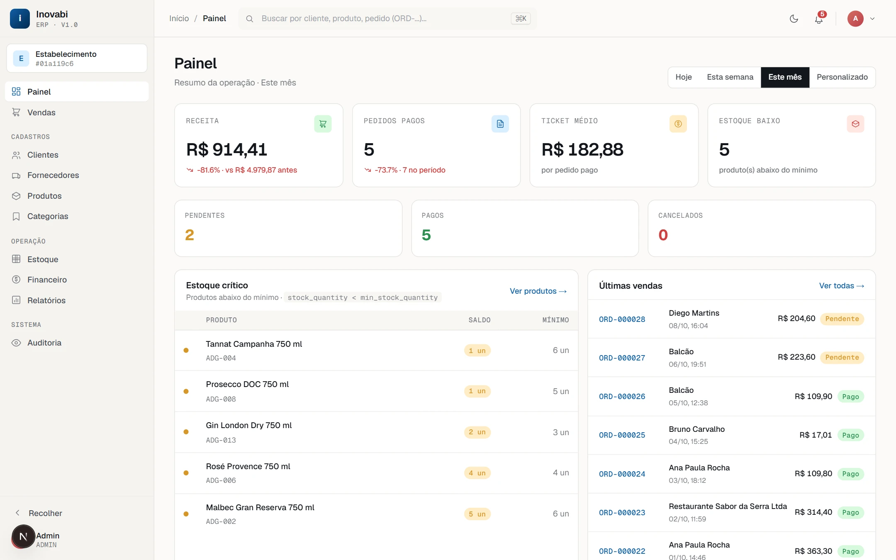
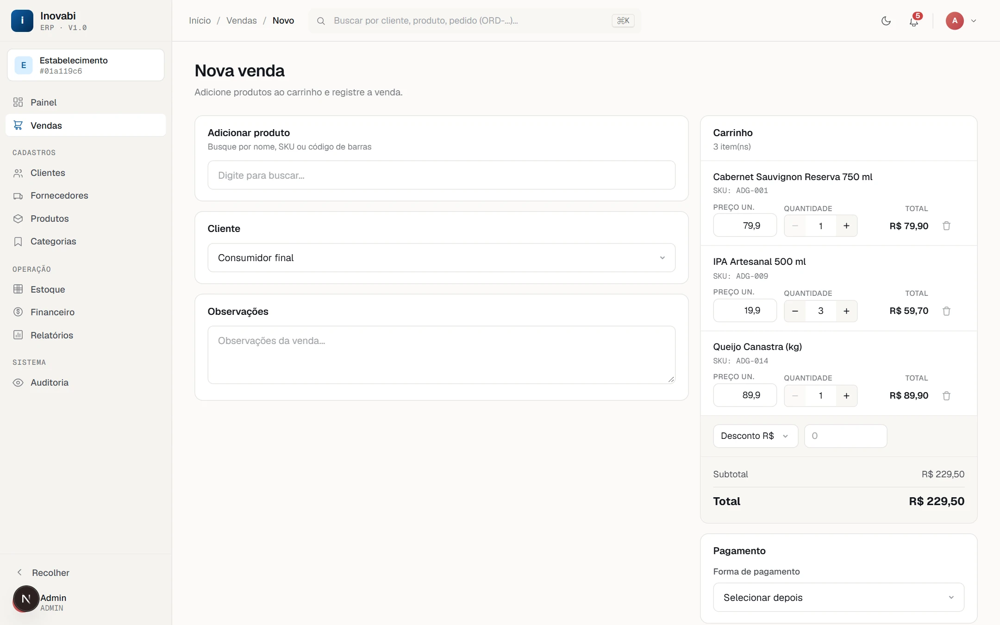
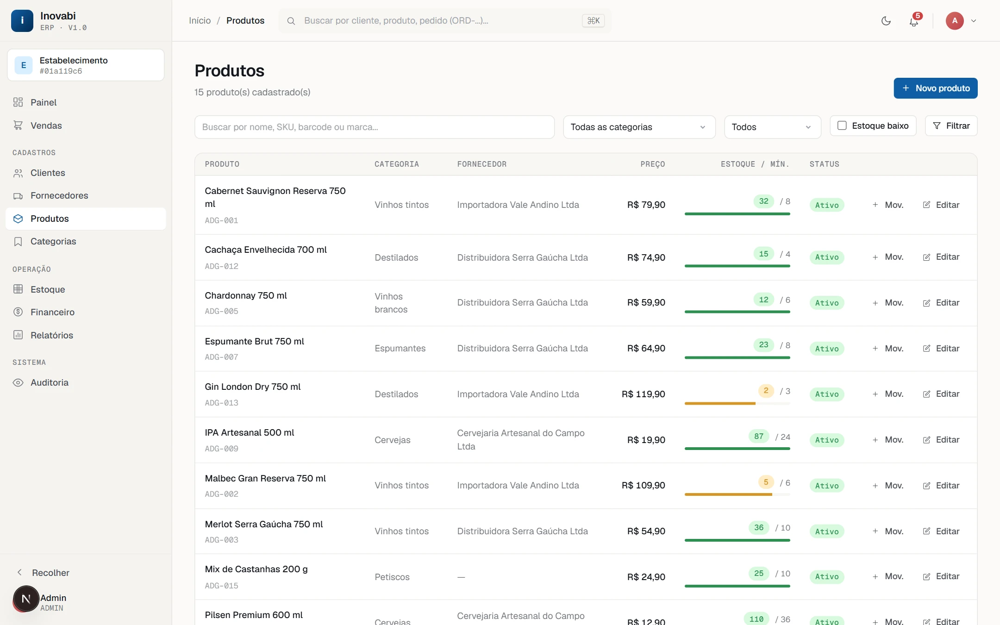
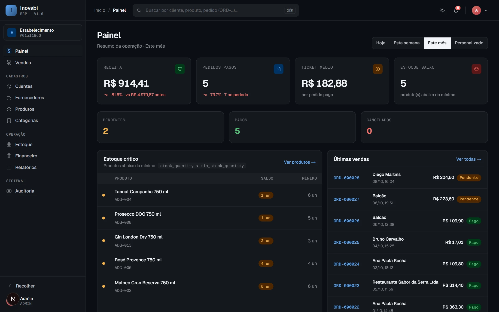

# ERP Comercial

Sistema ERP comercial multi-tenant com arquitetura preparada para evolução **offline-first**. Atende lojas, restaurantes e adegas com módulos de cadastros, estoque, vendas (PDV) e financeiro.

> **Status atual:** Fase 1 em andamento e em produção — cadastros, estoque, PDV, financeiro, relatórios, auditoria e notificações funcionando. Veja o [roadmap](docs/arquitetura/roadmap.md) completo.



<table>
  <tr>
    <td width="50%"></td>
    <td width="50%"></td>
  </tr>
  <tr>
    <td align="center"><b>PDV</b> — carrinho, desconto e pagamento</td>
    <td align="center"><b>Produtos</b> — estoque contra o mínimo, por item</td>
  </tr>
  <tr>
    <td colspan="2"></td>
  </tr>
  <tr>
    <td colspan="2" align="center"><b>Tema escuro</b> — tokens oklch, tema claro/escuro guardado em cookie</td>
  </tr>
</table>

<sub>Telas do ambiente local com dados de demonstração (produtos, clientes e vendas fictícios de uma adega).</sub>

---

## Stack

| Camada | Tecnologia |
|---|---|
| Backend | Laravel 13 (PHP 8.4 + FPM), MySQL 8.0 |
| Frontend | Next.js 16 (App Router, Server Actions), TypeScript, Tailwind CSS |
| Autenticação | Laravel Sanctum (token-based) + Spatie Permission (RBAC) |
| Infra | Docker Compose, nginx, GitHub Actions (CI/CD) |
| Identificadores | UUID v7 em todas as tabelas |
| Testes | PHPUnit — 167 testes, 437 asserções (backend) · Vitest — 24 testes (frontend) · Deptrac nas fronteiras de camada |

---

## Módulos implementados

| Módulo | Backend | Frontend | Testes |
|---|---|---|---|
| Autenticação | login, logout, me | tela de login, cookie token | — |
| Clientes | CRUD + filtros + paginação + `?all=1` | lista, novo, editar, excluir | 18 |
| Categorias | CRUD + subcategorias + `?all=1` | lista, novo, editar, excluir | 22 |
| Fornecedores | CRUD + `?all=1` + CNPJ único/tenant | lista, novo, editar, excluir | 18 |
| Produtos | CRUD + `?all=1` + SKU/barcode únicos/tenant | lista, novo, editar, excluir | 21 |
| Estoque | in/out/adjustment + lock atômico | lista filtrada, registrar mov. | 15 |
| Vendas / PDV | OrderService + eventos + pay/cancel | lista, PDV, detalhe (pagar/cancelar) | 22 |
| Financeiro | contas a pagar/receber + `finance:mark-overdue` | lista, registrar, pagar | 18 |
| Auditoria | logs imutáveis + LogsActivity nos models | tela admin com filtros | — |
| Dashboard | métricas agregadas por período | cards, estoque crítico, últimas vendas | 5 |
| Relatórios | sales, top-products, cash-flow, accounts (+CSV) | 4 telas com export CSV | 13 |
| Usuários | CRUD + reset de senha + papéis (RBAC) | lista, novo, editar | 13 |
| Notificações | estoque crítico/zerado, contas vencidas, broadcast | sino na topbar + `/notifications` | — |
| Perfil e configurações | perfil, senha, avatar, preferências, estabelecimento | `/profile`, `/settings`, `/preferences` | — |
| **Design system** | — | tokens oklch, tema light/dark, sidebar/topbar, Geist | — |

---

## Rodando localmente

```bash
git clone https://github.com/DiogoWallace/erp-lambadega.git
cd erp-lambadega
cp backend/.env.example backend/.env
docker compose up -d --build
docker compose exec backend php artisan key:generate
docker compose exec backend php artisan migrate:fresh --seed
```

Acesse:

- **Frontend:** http://localhost:8000
- **API:** http://localhost:8001/api
- **Credenciais iniciais:** `admin@inovabi.com` / `password`

### Atalhos (Makefile)

```bash
make test           # roda a suite completa (backend + frontend)
make test-backend   # 167 testes PHPUnit (SQLite in-memory, ~15s)
make test-frontend  # 24 testes Vitest
make migrate        # php artisan migrate
make seed           # php artisan db:seed --class=RoleSeeder
make fresh          # migrate:fresh --seed
make shell          # bash no container backend
make logs           # docker compose logs -f backend
```

Para detalhes (troubleshooting, hot-reload), veja [docs/tutoriais/rodar-local.md](docs/tutoriais/rodar-local.md).

---

## Ambientes

| Ambiente | URL | Branch | Deploy |
|---|---|---|---|
| Local | http://localhost:8000 | qualquer | manual |
| Dev | https://dev.inovabi.com | `dev` | automático (push) |
| Produção | https://inovabi.com | `main` | automático (PR `dev → main`) |

O CI/CD está em [`.github/workflows/`](.github/workflows). Veja [docs/tutoriais/deploy.md](docs/tutoriais/deploy.md) para detalhes.

---

## Estrutura do repositório

```
erp-comercial/
├── backend/
│   ├── app/
│   │   ├── Models/Concerns/      # HasUuidV7, BelongsToEstablishment
│   │   ├── Http/
│   │   │   ├── Controllers/Api/  # Sem lógica de negócio — só HTTP
│   │   │   ├── Requests/         # Validação por módulo (escopo multi-tenant)
│   │   │   └── Resources/        # Transformação JSON (JsonResource)
│   │   ├── Policies/             # Autorização acoplada ao model (auto-descoberta)
│   │   └── Services/             # Regras de negócio, queries, transações
│   ├── database/
│   │   ├── migrations/           # UUID v7 + establishment_id em tudo
│   │   ├── factories/            # EstablishmentFactory, UserFactory + 5 módulos
│   │   └── seeders/RoleSeeder.php  # 4 roles, 29+ permissões (idempotente)
│   ├── tests/Feature/Api/        # 96 testes (SQLite in-memory)
│   └── routes/api.php
│
├── frontend/
│   ├── proxy.ts                  # Auth check na borda (Next.js 16)
│   ├── vitest.config.ts          # Config de testes unitários
│   └── app/
│       ├── layout.tsx            # Root layout (force-dynamic; aplica tema no <html>)
│       ├── global-error.tsx      # Root error boundary
│       ├── globals.css           # Tokens do design system (oklch + Geist)
│       ├── (dashboard)/          # Route group — rotas autenticadas
│       │   ├── __tests__/        # Testes Vitest para buildBody dos módulos
│       │   ├── layout.tsx        # force-dynamic; carrega /auth/me + tema
│       │   ├── sidebar-nav.tsx   # Sidebar com pin/favoritos/colapso
│       │   ├── topbar.tsx        # Breadcrumbs + toggle de tema + logout
│       │   ├── customers/ categories/ suppliers/ products/ stock-movements/
│       │   ├── sales/ finance/ audit-logs/ reports/
│       │   └── dashboard/        # Métricas agregadas + seletor de período
│       ├── lib/api.ts            # apiFetch (injeta token, trata 401/403/5xx)
│       ├── lib/theme.ts          # getTheme + toggleThemeAction (cookie 'theme')
│       ├── lib/types.ts          # Interfaces TypeScript de todos os modelos
│       └── ui/
│           ├── icons.tsx         # Componente Icon (SVG inline; IconName tipado)
│           └── skeletons.tsx     # TableSkeleton, FormSkeleton
│
├── docs/
│   ├── arquitetura/              # Visão de longo prazo, decisões técnicas, roadmap
│   ├── banco-de-dados/           # Schema por módulo
│   ├── tutoriais/                # Como rodar e deployar
│   └── ia/contexto.md            # Contexto completo para agentes de IA
│
├── Makefile                      # Atalhos de desenvolvimento
├── docker-compose.yml            # Local
├── docker-compose.dev.yml        # Dev (VPS)
└── docker-compose.prod.yml       # Produção (VPS)
```

---

## Arquitetura

A arquitetura é desenhada em três fases. Leia antes de implementar qualquer módulo novo.

- [Visão geral](docs/arquitetura/visao-geral.md) — modelo hub-and-spoke, fases de evolução
- [Multi-tenant](docs/arquitetura/multi-tenant.md) — isolamento por estabelecimento via global scope
- [Identificadores](docs/arquitetura/identificadores.md) — por que UUID v7 em todas as tabelas
- [Sincronização](docs/arquitetura/sincronizacao.md) — protocolo de sync entre central e local (Fase 2)
- [Vendas — eventos](docs/arquitetura/vendas-eventos.md) — DTOs, eventos/listeners, InventoryService, Deptrac
- [Auditoria](docs/arquitetura/auditoria.md) — logs imutáveis, trait `LogsActivity`, AuditService
- [Design system](docs/arquitetura/design-system.md) — tokens oklch, tema cookie-based, shell sidebar/topbar
- [Roadmap](docs/arquitetura/roadmap.md) — o que está pronto, em andamento e planejado
- [Contexto IA](docs/ia/contexto.md) — guia completo para agentes de IA

---

## Convenções

- **Código e identificadores em inglês**; **documentação em PT-BR**; **commits em inglês** com prefixo (`feat:`, `fix:`, `docs:`, `refactor:`, `chore:`)
- **Deploy em produção = PR `dev → main`** — nunca push direto em `main`
- **Arquitetura de camadas:** `Controllers/Api` (só HTTP) → `Services` (negócio) → `Resources` (output)
- **Todo model de domínio** usa `HasUuidV7` + `BelongsToEstablishment`
- **Migrations** sempre usam `foreignUuid`, nunca `foreignId`
- **Ao criar módulo novo:** adicionar permissões no `RoleSeeder` e re-executar `make seed`
- **Frontend:** `apiFetch` para todas as chamadas em Server Components; Server Actions em `actions.ts`

---

## Licença

Proprietário — Inovabi.
